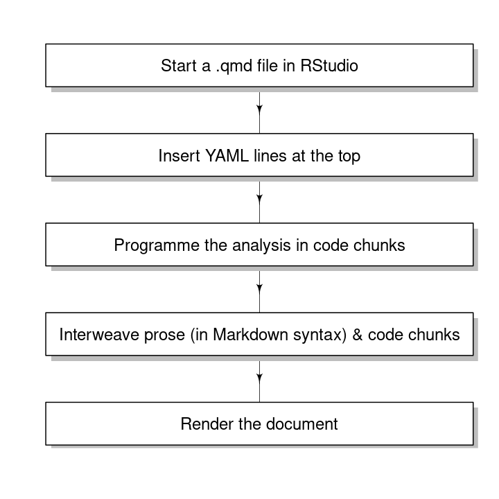

## 2.1 Introduction
This chapter is a gentle introduction to the literate programming approach, with the following **learning outcomes**: 

* Understand why the old, manual approach of analysis and reporting does not facilitate reproducibility
* Learn the key concepts of literate programming
* Appreciate the usefulness of literate programming
* Familiarise with (the names of) the components covered in the next few chapters

## 2.2 The Old Workflow
To begin with, let me ask you a couple of questions:

1. How do you usually organise your scripts and files when you conduct research?
2. What is your workflow of creating a deliverable (report, presentation slides, etc.) from these scripts?

### 2.2.1 Example structure
You may have the following files in a folder:

```
#> |--- data
#> |    |--- breast-cancer-wisconsin.csv
#> |
#> |--- analysis.R
#> |--- histogram.jpg
#> |--- correlation.png
#> |--- report.tex
#> |--- report.log
#> |--- references.bib
```

They can be put into the following groups:

1. data (.csv)
2. programming scripts (**.R**)
3. image files (.png, .jpg, etc.)
4. plain text files (.tex)
5. auxiliary files (.bib, .log, subfolders)

While you may not have come across with files with extension .tex, you are likely to have worked with .txt files, which are also plain text files without any text formatting.

### 2.2.2 Example workflow
These steps are usually followed:

1. run the programming scripts in an Integrated Development Environment (IDE),
2. save the required plots to the image files,
3. edit the plain text files (writing the explanatory text and inserting numbers and tables manually), and
4. generate the report or the slides you want.

If you are working with others, you may be collaborating through a tool such as [Overleaf](https://www.overleaf.com/), and this means an extra step of uploading the files before the final step. Done and dusted.

### 2.2.3 Changing the data / analysis
Now, it is common that the analysis changes direction as you go along, and/or that the data is updated. What do you do when that happens? You re-run the scripts, save the image files, (optionally) upload them, and generate the deliverable again. And this is usually done multiple times and in an iterative fashion. One or more of the following scenarios eventually happens:

1. You have changed the analysis and edited the programming scripts on your computer, but have not updated the results (plots, numbers, tables) in the plain text files. When you revisit the deliverable after some time, the results reported do not match what you get from running the scripts.
2. You have decided to change the analysis to a previous direction, but because the scripts have been updated, you cannot revert exactly to what you want.
3. To avoid the above scenario, you create a new set of programming scripts every time you change the analysis. Eventually it becomes difficult to find the right version (again).

If you feel dissatisfied with this workflow, you will benefit from this training programme. You will be able to adopt a more efficient workflow that not only generates a deliverable with reproducible results, but also keeps track of the versions of the files so there won't be anything like `presentation-final-final-02.pdf`.

## 2.3 Literate Programming
Practically, literate programming (almost) means merging the **.R** and .tex files in the old workflow. Let's start with a snippet of a non-literate-programming R script (you can access the full script [here](https://github.com/elixir-europe-training/ELIXIR-TrP-LiterateProgrammingR-CodeRep/blob/main/docs/scripts/analysis.R)):

```
cancer_data <- read.csv("data/breast-cancer-wisconsin.csv") # load the data
head(cancer_data) # print the first few lines
dim(cancer_data) # the dimensions
colnames(cancer_data) # column names
```

It is an acceptable practice to comment the code so others, including your future self, will understand the analysis. However, the comments make the code more difficult to read as the analysis expands, and it is better to have the code and the text that explains the analysis (called the prose hereafter) in separate sections, but still in the same file. This *is* the essence of literate programming.

### 2.3.1 First pass
Let's try to separate the code and prose in the same file in the most naive way, without thinking about what format it is yet:

```
We first load the Wisconsin breast cancer data:
cancer_data <- read.csv("data/breast-cancer-wisconsin.csv")
Then we print the first few lines, the dimensions and the column names:
head(cancer_data)
dim(cancer_data)
colnames(cancer_data)
```

!!! question "Excercise"

    Can you think of any potential problems with this piece of code?

    ??? success "Solution"

        Here are some potential problems we can think of (you may have similar):
        
        1. How does someone else tell the code from the data?
        2. This piece of code cannot be run as running the prose will return errors. Then what good does it do to me?

### 2.3.2 Second pass
It is the worst of both worlds if neither a human nor a machine can understand the lines. Fortunately, standards and syntaxes have been created to make literate programming possible. This is how such a script looks like:

````
We first load the Wisconsin breast cancer data: 

```{r}
cancer_data <- read.csv("data/breast-cancer-wisconsin.csv")
```

Then we print the first few lines, the dimensions and the column names:

```{r}
head(cancer_data)
dim(cancer_data)
colnames(cancer_data)
```
````

Notice the extra lines that begin with triple backticks, which separate the prose from the code. We shall call any R code, together with the preceding line (triple backticks and `{r}`) and succeeding line (triple backticks) a *code chunk*. Code chunks will be an important concept throughout.

### 2.3.3 Self-contained file
What you have seen above is just a snippet. A self-contained file will look like this:
````
---
title: "Analysis of Wisconson Breast Cancer Data"
date: "2023-06-06"
author: "CodeRep Literate Programming Team"
output: pdf_document
---

We first load the Wisconsin breast cancer data: 

```{r}
cancer_data <- read.csv("data/breast-cancer-wisconsin.csv")
```

Then we print the first few lines, the dimensions and the column names:

```{r}
head(cancer_data)
dim(cancer_data)
colnames(cancer_data)
```
````

### 2.3.4 The components
This hybrid format starts to get confusing, as you may wonder what all those triple dashes, triple backticks, lines at the top etc. do. This is a good point to preview the next few chapters:

1. The syntax of the file, barring the code chunks, is in Markdown, which will be introduced in [next chapter](../chapter_03). If you have used LaTeX to write documents, Markdown is a similar (yet simpler) typesetting system. As we will see, it has a gentler learning curve and more functionality to offer.
2. At the top, between the two lines of triple dashes, those few lines are what we called YAML. If you look it up on [Wikipedia](https://en.wikipedia.org/wiki/YAML), you might not find the definition of YAML very useful. However, it is an integral part of Markdown, as it makes the deliverable look how you want it. An equivalent in LaTeX is the preamble before `\begin{document}`.
3. The file format is called Quarto ([Chapter 4](../Chapter_04)), which facilitates the interweaving of code chunks and prose. When you save the file, the file extension is **.qmd**. 

## 2.4 Unleashing the Powers of Quarto and Markdown
You will find that we have gone quite far if you compare the first R code snippet and the self-contained file, which we will name **`wisconsin.qmd`**. But fundamental questions remain: Why should you bother? How does literate programming resolve the issues we mentioned?

### 2.4.1 Reproducibility
This is one of the biggest selling points of literate programming. As we will see in coming chapters, how the self-contained file is written allows results to be generated *on the fly* when you generate the deliverable.

!!! question "Exercise"

    What good does generating the results *on the fly* practically do? In other words, how has the workflow changed for the better?
    
    ??? success "Solution"

        Here are a few changes that would occur to the workflow:

        1. You do not need to run **`analysis.R`** first to save `histogram.jpg` and `correlation.png`, before generating the deliverable in `report.tex`. You just make any necessary changes in **`wisconsin.qmd`**.
        2. The same goes for numbers and tables. You do not need to pre-compute say the $t$-statistic, manually input in `report.tex`, and then generate the deliverable. Again, just edit **`wisconsin.qmd`**.
        3. Your collaborator sends you a new set of data with more rows? No problem, the dimensions (`dim(cancer_data)`) and everything else will be updated.

The answers to the question above are what reproducibility is about.

### 2.4.2 Version control, and more
Reproducibility is greatly enhanced if you combine literate programming with version control. Essentially, you track the changes made to **`wisconsin.qmd`** and all the other files (but pherhaps not in the same way word processing systems track changes in word documents), so the safety net of previous versions is always there for you to fall back in case mistakes are made in your analysis. Practically and more importantly, you will not need to duplicate files and name them **`wisconsin-draft.qmd`**, **`wisconsin-draft-02.qmd`**, **`wisconsin-final.qmd`**, **`wisconsin-final-final.qmd`**. You will learn more in the module on [version control](../../../ELIXIR-TrP-VersionControlR-CodeRep/).

There is more that needs to be done to complete reproducibility i.e. your analysis can be full reproduced on someone else's computer, without the need of ever say "but it worked on my computer yesterday". This is where [documentation](../../../ELIXIR-TrP-DocumentationR-CodeRep/), [software testing](../../../ELIXIR-TrP-TestingR-CodeRep/), [CI/CD](../../../ELIXIR-TrP-CICD-R-CodeRep/), and [containers](../../../ELIXIR-TrP-ContainersR-CodeRep/) come in.

### 2.4.3 Same script, multiple formats 
The whole system of Quarto and Markdown allows us to generate deliverables in multiple formats. Usually it involves (almost) changing nothing in the **.qmd** file. You have created some slides in pdf and want to convert them to html so that you can host them on your website? There's no need for conversion, you can generate the html slides directly. You have written a pdf document and need to change it to word document (e.g. for some collaborators who work with word documents exclusively) and html page (e.g. for accessibility reasons)? No problem, just focus on writing the content, Quarto and Markdown will take care of the formats for you, once you specify what you want (this is, as you will learn, where YAML comes in).

### 2.4.4 Testament
You may already notice the self-referentiality of these materials - yes, they have been written using the literate programming approach. And what is the syntax in which they are written? Markdown. And are they version controlled? Absolutely yes. Once you have understood enough, you can even look at the files for generating these materials. I hope that will convince you to start adopting these practices.

## 2.5 Summary

* To put it simply, in literate programming, we put the code and the prose that explains the code in the same file.
* The code and the prose are formatted differently so that computers (and users) can tell them apart.
* Practising literate programming in this way facilitates reproducibility, and enables other steps in the complete workflow.
* Markdown and Quarto are two important components in literate programming.
* The literate programming workflow is summarised below:

<figure>

<figcaption> Figure 2.1 The workflow of literate programming. The steps will be covered in detail in the next two chapters. </figcaption>
</figure>


## 2.6 Still confused?
One major obstacle with learning literate programming, and the rest of this training programme is that the sheer amount of technical terms aka jargons confuses a researcher who codes but is not primarily in the field of computing and statistics. Here is a glossary that contains the terms that you might have come across with. If this looks Greek to you, don't worry, come back to this after you have covered the next two chapters. 

- RStudio: Some poeple equate RStudio (the IDE) with R (the programming language), because they have been using RStudio the whole time to code in R, even though such equivalence is technically inaccurate. They cannot be blamed, however, because RStudio is arguably the best IDE for R, and there is growing support for other languages such as Julia, Python, C++, etc. And yes, you can write Quarto and Markdown documents in RStudio. The company that created RStudio has recently been renamed Posit, as the IDE becomes more agnostic on the programming language.
- Rmarkdown: The predecessor of Quarto, and essentially R + Markdown. There is another slightly inaccurate equivalence between Markdown and Rmarkdown. In short, an Markdown document is also an Rmarkdown document, but the converse is not true.
- pandoc: The description on [its official page](https://pandoc.org/) cannot be more precise: it is a universal document converter. This is the magic that creates the deliverable in multiple formats. You do not need to know how to work with pandoc directly, because RStudio takes care of it in the background.
