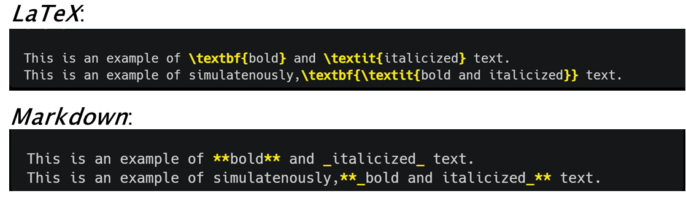

Learning Outcomes:

* Understand that markdown is a text formatting language
* Understand why markdown is useful for literate programming
* Learn basic of markdown that can be applied for literate programming

## 3.1 What is Markdown?

Markdown is a simple markup language created by [John Gruber in 2004](https://daringfireball.net/projects/markdown/). As a markup language, Markdown, allows you to format plain text to enhance presentation and readability of your text.  From a technical perspective, Markdown is two things: (i) a syntax or grammar for formatting plain text files and; (2) a software tool that converts plain text files to [HTML](https://en.wikipedia.org/wiki/HTML). As a software Markdown is free and platform independent, meaning it can br run any device using any operating system.

When using Markdown you annotate your text with chracters, such  as \*s or \#s, to achieve a desired formatting effect on that text (e.g. make a heading). In this sense it is different from [WYSIWYG](https://en.wikipedia.org/wiki/WYSIWYG) editors like Microsoft Word where you use buttons, keystrokes and mouse strokes to acheive a desired effect. Also, unlike WYSIWYG editors, you won't see the fruit of your formatting labours without an additional step of rendering your plain text file or notebook document into an HTML or other document format (these days some IDE's, e.g. the [visual markdown editor in RStudio](https://posit.co/blog/exploring-rstudio-visual-markdown-editor/), support WYSIWYG rendering of Markdown in real time). 


## 3.2 Why Markdown for Literate Programming?

[Recall](../chapter_01) that for literate programming, the narrative, rather than code, is the key focus, hence relevant and appropriate formatting of your text (e.g. using **bold** or *italic* font or incorporating images) is essential for other humans (perhaps your colleagues) to make sense of and engage with your code or analysis. Hence, literate programming involves mixing your code (written in Python,R etc.) with a document formatting or typesetting language to format your expositry narrative. HTML and [LaTeX](https://www.latex-project.org/) are two popular markup languages utilized for document formatting in literate programming for scientific research. However, unlike these other markup langguages, Markdown is simple and lightweight. This means you can focus on constructing engaging and efficient narrative without kicking a fuss over what code or tag is required to make your text appear, for e.g., in **bold** or *italic* font. Compared to other markup languages, you can learn Markdown quickly and hence focus more on your content writing.

**Figure 3.1** displays a comparison of the code require to format plain text into bold, italic or both in LaTex _versus_ Markdown. From the code below it showed be obvious how the markdown syntax is much simpler than LaTeX (or indeed other markup languages). Additionally, withouth even rendering the markdown annotated text, it remains easily readable by humans. More complex formatting like generating tables, inserting images, requires even more complex code in markup languages like LaTex or HTML, but remains simple in Markdown as you will see in the next section. This simplicity of Markdown means there is little overhead in learning the document formatting language for literate programming, freeing your mind to focus on your content.

 
<figure>

<figcaption> Figure 3.1 Comparing markup syntax of Latex verus Markdown. Code for either markup language is highlighted in yellow. On rendering either document, the markedup text should display in bold, italics or both. </figcaption>
</figure>

Markdown's growing popularity as the document formatting language of choice in literate programming needs is reflected in the availability of markdown support (in many cases right out of the box without any additional installation!) for popular IDEs and notebook formats such as RStudio, VS Code, Jupyter Notebooksand even GitHub (a code hosting platform for colloboration and version control - if you are unfamiliar with GitHub, don't worry, this will be covered in a following course). 

!!! info "Basic Markdown _vs._ Markdown Extensions"

    Markdown's simplicity comes at a cost: there are only a limited amount of formatting effects available to you in **basic** or **vanilla** Markdown. However, many applications supporting Markdown e.g. Jupyter Notebooks, R/RStudio,  
    GitHub etc. provide thier own [**extensions** of Markdown syntax](https://www.markdownguide.org/extended-syntax/) which let you do more complex formatting with the simplicity of Markdown-like syntax. Additionally,
    if your needs ever grow, worry not, tools like [pandoc](https://pandoc.org/) allow you to mix more flexible formatting languages such as LaTeX and/or HTML with Markdown allowing you to format your text to 
    your heart's desire.

## 3.3 How to use Markdown

It's time to get our hands dirty and start getting some practise in how to use Markdown to format our text. For the examples and exercises that follow, you will need to implement markdown in RStudio/Quarto. Latest versions of RStudio come pre-installed with Quarto.

In **Rstudio** you can do this as follows:

1. Go to the *File* menu, select *New file*, theb select *Quarto Document...*, alternatively you also use the **new file button** to do the same, and this is what is done in the video below. This will open up a *dialog* box with several options. Leave everything as default but **uncheck** the `use visual markdown editor` option. Feel free to add a **Title** and **Author** in the relevant fields, then hit the **create** button.
2. This will open a new **Quarto Document** in RStudio's **source** editor (this where you normally write your R scripts). You can then add your text and markdown annotation in the **body** of the document. The **body** of the document referes to any space below the text between the `---` at the top. This latter section is called the YAML and controls how the document will look when rendered. You can just ignore the YAML for now, we'll talk more about this in the (next lesson)[../Chapter_04]. Note that RStudio will automatically generate some standard text, code and markdown to give you flavour of this literate programming document works. *Optional:* delete everything in the body of the file making sure **not to delete** the YAML.
3. After adding your text and markdown annotation to the document hit the `render` button to generate an HTML document (default). If you haven't yet saved your document, RStudio will ask you save the document before rendering. Once saved, RStudio will generate an HTML docuement that shows your text but formatted according to any markdown code. The next time you make a cahnge to your Quarto Document and hit **render**, RStudio will automatically save the changes to your Quarto document before rendering.
 


!!! info "Rendering Markdown without a rendering step"


    Since 2021 RStudio now has also has a [**visual** markdown editor](https://posit.co/blog/exploring-rstudio-visual-markdown-editor/) that renders your markdown formatting live as 
    you type it in the Quarto document.

### 3.3.1 Formatting text

You should have already seen examples of how to _italicise_ or **embolden** you text (and both simulatenously) with markdown. There is other useful markdown sytnax for example for starting a new paragraph, use a blank like to seperate your paragraphs or if you want a [monospaced font](https://en.wikipedia.org/wiki/Monospaced_font) to represent `code` in your text, enclose the relevant code in single backticks:\`\<YOURCODEHERE>\`.

!!! question "Exercise"

    Below is some text produced using markdown formatting. Use your preferred markdown editor, to write markdown annotated text, to achieve the following result:   
    
    The `mean()` function on `line 13` calcualtes the **average** of the vector.

    Make sure to render your markdown text to make sure it works like you think it should.

    ??? success "Solution"
    
        ```The `mean()` function on `line 13` calcualtes the **average** of the vector.```

As mentioned in Section 3.2, Markdown's simplicity comes at a cost. Not all formatting elements are natively represented in markdown. Depending on your application an **extended syntax** for Markdown may exist (e.g. [Rmarkdown](https://rmarkdown.rstudio.com/), which may offer a solution. In many cases HTML can help you acheive the desired result. Most applications rendering Markdown also support HTML. This does not mean you need to know HTML but you may have to rely on your googling or [prompt engineering](https://en.wikipedia.org/wiki/Prompt_engineering#:~:text=Prompt%20engineering%20is%20a%20concept,of%20it%20being%20explicitly%20given.) skills.

!!! question "Exercise"

    There is no native support for sub- or superscripts in markdown, however HTML tags can do the trick. Use your technical sophistication (googling or otherwise) to write Markdown- (and HTML) formatted text text to achive the following result:  
    
    An example of a subscript is C0<sub>2</sub>. An example of a superscript is 3<sup>3</sup>=27.

    Make sure to rener your markdown text to make sure it works like you think it should.

    ??? success "Solution"

        An example of a subscript is C0`<sub>`2`</sub>`. An example of a superscript is 3`<sup>`3`</sup>`=27.

        `<sub></sub>` and `<sup></sup>` are the HTML tags for subscripts and superscripts respectively. Some Makrdown editos also support encapsulating text in \^ or \~ for formattting superscript and subscript. respetively.

### 3.3.2 Adding Headers

Your literate programming document needs to be divided into sections. Perhaps you sub-sections or sub-sub-sections? Markdown provides simple syntax for **header** formatting that provides **6 levels** of headings to fullfill your sub-sectioning needs. To render headers using markdown all you need to do is start a line with a `#`, followed by a space and then your title, like so:

!!! example "Headers"

    === "Markdown:"

        ```#### My Excellent Title```
        

    === "Rendered output:"

        #### My Excellent Title

        
The number of `#` controls the size or level of the headers - more means smaller headers.

!!! question "Generating Headers of different size"

    The following headers have been produced using Markdown. Can you reproduce them using Markdown-formatted text?

    #### My smaller section title

    ##### This is my _other_ header
    
    ??? success "Solution"

        ```#### My smaller section title```

        ```##### This is my _other_ header```

### 3.3.3 Making Lists

Every now and then, documentation of your code or analysis will need a list. Maybe it is a list of dependencies your colleague s need to run your code or perhaps it a list of genes you need to highlight in your latest gene expression anlaysi. It is easy to generate lists in Markdown. Basic Markdown supports ordered (i.e. numbered) or unordered lists.

You can make ordered ordered lists by adding line items with numbers followed by periods. The numbers don’t have to be in numerical order, but the list should start with the number one.

!!! example "Ordered lists"

    === "Markdown:"

        ```
        1. first item
        2. second item
        3. third item
        ```

    === "Rendered output:"

        1. first item
        2. second tiem
        3. third item

You can generate an unordered list, add dashes (-), asterisks (*), or plus signs (+) in front of line items.
    
!!! example "Unordered lists"

    === "Markdown:"

        ```
        * first item
        * second item
        * third item
        ```

    === "Rendered output:"

        * first item
        * second tiem
        * third item


!!! question "Making nested lists"

    It is easy to generate nested lists in Markdown. Can you reproduce the following nested list using Markdown-formatted text?

    1. First item
    2. Second item
    3. Third item
         - Indented item A
         - Indented item B
    4. Fourth item
    
    ??? success "Solution"

        ```
        1. First item
        2. Second item
        3. Third item
             - Indented item A
             - Indented item B
        4. Fourth item
        ```
   
### 3.3.4 Adding Images and Links

Every now and then you may need to provide a link in your literate document. You can provide links in basic Markdown in two ways. The first one we demonstrate are called _inline_links: here you provide the text of the link in square brackets (++bracket-left++ ++bracket-right++`) and the link itself follows in paranthesis.

!!! example "Inline links"

    === "Markdown:"

        ```
        [Visit Elixir!](https://elixir-europe.org/)
        ```

    === "Rendered output:"

        [Visit Elixir!](https://elixir-europe.org/)

The other type of link in basic Markdown is a _reference_ link. In this case the link is to another place in your literate document itself, kind of almost like a citation. 

!!! example "Reference links"

    === "Markdown:"

        ```
        Want to do [Repdroducible Science?][link one]
        Here are some [practical guides][another-link]. 
        Don't forget to read [this article][link one] in its entirety. 
    

        [link one]: https://www.nature.com/articles/s41562-016-0021
        [another-link]: https://ziemann-lab.net/public/5pillars/practical_guides.html
        ```

    === "Rendered output:"

        Want to do [Repdroducible Science?][link one].
        Here are some [practical guides][another-link]. 
        Don't forget to read [this article][link one] in its entirety. 
       

       [link one]: https://www.nature.com/articles/s41562-016-0021
       [another-link]: https://ziemann-lab.net/public/5pillars/practical_guides.html

        
The "references" above are the second set of brackets: [link one] and [another-link]. At the bottom of a Markdown document, these brackets are defined as proper with a colon and then links to outside websites. An advantage of the reference link style is that multiple links to the same place only need to be updated once, as you would expect from a citation management software e.g. (Zotero), but as you'll see later there are better ways to do citations using extended in Markdown. Also note the reference links (the one at the bottom) don't actually appear in the renderded markdown document above.

Similar to links you can add images in two ways. Additionally images can be online urls or from your local computer (in which case you need to provide the path to the image on your local computer instead of the url). Similar to links, one way to displayimg images is called _inline image_ link. To generate one if these you add an exclamation mark (++exclam++), followed by square brackets (++bracket-left++ ++bracket-right++) that can optional include [alt text](https://www.w3schools.com/tags/att_img_alt.asp) the image (to make your content more accessible for visually impaired readers) and then finally the link (or path) to the image in parenthesis.


!!! example "Inline image links"

    === "Markdown:"

        ```
          

        "Artwork from "Hello, Quarto" keynote by Julia Lowndes and Mine Çetinkaya-Rundel, presented at RStudio Conference 2022. Illustrated by Allison Horst."
        ```

    === "Rendered output:"

           
         "Artwork from "Hello, Quarto" keynote by Julia Lowndes and Mine Çetinkaya-Rundel, presented at RStudio Conference 2022. Illustrated by Allison Horst."
         
You can make _reference image_ links very similar to how you would make inline links. Redoing the inline image link is a reference image link is left as an **exercise** for the reader. 

        
### 3.3.5 Making Tables

At some point in your literate document, you may want to present information in a table. Although basic Markdown does not come with a syntax to make tables, almost all [extensions](https://www.markdownguide.org/extended-syntax/#tables) now have a universal syntax to do so. 

To make a table, use three or more hyphens (---) to create each column’s header, and use pipes (|) to separate each column.

!!! example "Tables"

    === "Markdown:"

        ```
        | Column 1    | Column 2    |
        | ----------- | ----------- |
        | blah        | blah        |
        | blah        | blah        |
        ```
        **Note:** the cell widths don't have to be fixed as above and can vary, yiedling the same output (try it yourself if you don't believe me)
        
    === "Rendered output:"
    
        | Column 1    | Column 2    |
        | ----------- | ----------- |
        | blah        | blah        |
        | blah        | blah        |

!!! exercise "Making a two column table"

    Can you write the Markdown-formatted text to generate the exact following table (don't forget the cell alginment)?

    | Gene   | _p-value_   |
    | :---------- | :-------------- |
    | Gene A      | 0.1  |
    | Gene B      | 0.005|
    | Gene C      | 0.01 |

    ??? success "Solution"

        ```
        | Gene        | _p-value_ |
        | :----------:| :--------:|
        | Gene A      | 0.1  |
        | Gene B      | 0.005|
        | Gene C      | 0.01 |
        ```

!!! info "Making tables in Markdown..."

    Making small tables is simple enough but making larger tables can get painful in markdown. For larger tables in markdon the [Markdown Tables Generator](https://www.tablesgenerator.com/markdown_tables) is a great   
    tool. Make your table using their graphical interface and then copy the generated Markdown- 
    formatted text into your file. In RStudio you can use the [**visual** editor](https://posit.co/blog/exploring-rstudio-visual-markdown-editor/) to do the [same](https://rstudio.github.io/visual-markdown- 
    editing/content.html#:~:text=You%20can%20insert%20a%20table,delete%20command%20will%20behave%20accordingly.), so you don't even have to leave the warm confines of RStudio.

### 3.3.6 Paragraphs

Formatting paragrahs is simple but perhaps not as intuitive in Markdown. For example, consider the verse below (I got [ChatGPT](https://openai.com/blog/chatgpt) to wax poetic about the graces of Markdown):

In the realm of code, where words and logic intertwine,  
There exists a tool, both simple and sublime.  
Markdown, the poet's brush, the programmer's aid,  
Unveils the advantages of a seamless cascade.  

You may be tempted to think, that way you format a pargraph like this in Markdown would be like so:

```
In the realm of code, where words and logic intertwine,
There exists a tool, both simple and sublime.
Markdown, the poet's brush, the programmer's aid,
Unveils the advantages of a seamless cascade.
```

Unfortunately, if you did this the whole verse would come in a single line! Not very fitting for a poem.

To acheive the desired affect, you can enforce a _hard break_ by inserting a new line between each line of the verse:

!!! example "Hard breaks for formatting"

    === "Markdown:"
    
        ```
        In the realm of code, where words and logic intertwine,
        
        There exists a tool, both simple and sublime.
        
        Markdown, the poet's brush, the programmer's aid,
        
        Unveils the advantages of a seamless cascade.
        ```

    === "Rendered output:"

        In the realm of code, where words and logic intertwine,
        
        There exists a tool, both simple and sublime.
        
        Markdown, the poet's brush, the programmer's aid,
        
        Unveils the advantages of a seamless cascade.


The hard break works but not the formatting is now disconnected between the Markdown document and the rendered output. A more subtle way to achieve this sort of paragraph formatting effect is to use what is called _soft break_. A soft break involves inserting two blank spaces with the ++space++ key at the end of each line. A soft break acheives the same effect a a hard break but leaves more of a semblance between the text in the Markdown document and the final rendered document. which may be more desirable in several instances.

!!! question "Using soft breaks"

    Here is the last verse from the ChatGP epic poem about the advanatges of Makrdown for literate progamming:

    So let markdown be your ally, your creative friend,  
    In the realm of literate programming, where wonders never end.  
    For within its simplicity lies a powerful tool,  
    Unleashing the potential of both scholar and fool.  

    Use **_soft breaks_** in Markdown to recreate the formatted verse above.

## 3.4 Summary 

- Markdown is a simple language for formatting text.  
- Markdown is not the only tool for formatting text but it's easy to learn making it one of the most popular tools for various purposes including Literate Programming.  
- Markdown is supported by many of the popular IDEs including RStudio
- Although basic Markdown has limited functionality, many extensions, often language-specific, exist to enhance Markdown's capability.

