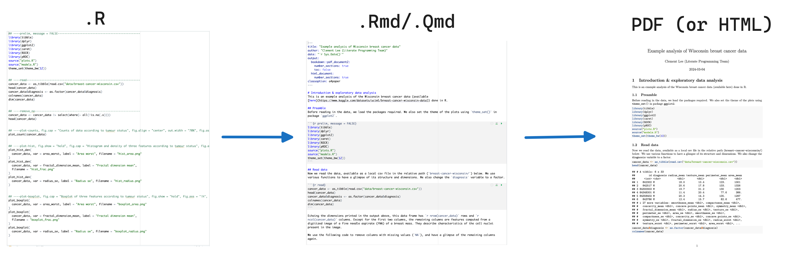

## 5.1 Putting it all together

Now that you have been introduced to:

1. The importance of literate programming (LP)
2. Using markdown to narrate your code
3. Using Quarto to knit your code and narrative into a single LP-compliant document

It is time for a more comprehensive rounding-off exercise to bring it all together.

!!! question "Exercise"

    Return to our original example of [non-LP script](https://github.com/clement-lee/coderep/blob/master/wisconsin.R)  (#81: do we need to introduce this in chapter?) and rework it into a full fledged literate programming document by applying uour knowledge of markdown and quarto
to transform the original script into an LP HTML or PDF document (Fig. 5.1).

    Specifically:
    
    1. Obtain the [Wisconsin.R](https://github.com/clement-lee/coderep/blob/master/wisconsin.R) script, copy the script into a new empty script in your RStudio environment  
    2. Convert the script into a .Qmd or .Rmd document, with explanatory text and code chunks for plain code and plots
    3. Knit your final .Qmd or .Rmd file to a PDF (or HTML) document 

    ??? success "Solution"

        There are no right or wrong answers here but certain solutions will definitely be better than others. if you get stuck or need inspiration check out one possible solution [here](https://github.com/clement-lee/coderep/blob/master/wisconsin.Rmd)

<figure>

<figcaption> Figure 5.1 Going from the script (Winconsin.R) to a Qmd (or Rmd) file that can be knitted into a LP PDF or similar LP document. </figcaption>
</figure>

